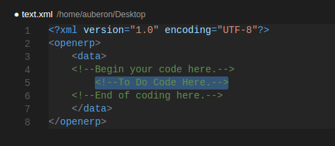

# <b>Odoo Snippets for Microsoft Visual Studio Code aka: CODE</b>
<a href="https://www.odoo.com/" style="text-decoration:underline;" target="_blank" >Odoo/Openerp</a> Snippet for <a href="https://code.visualstudio.com/" style="text-decoration:underline;" target="_blank" >MS Visual Studio Code</a>. 
This snippet aims to provide help to Odoo developers who wishes to use the <a href="https://code.visualstudio.com/" style="text-decoration:underline;" target="_blank" >Visual Studio Code</a> IDE.
 
#Avantages and Benefits: 
-----
  Easy encoding without worry on memorizing much on Odoo syntax.
 

<a href="https://www.paypal.com/cgi-bin/webscr?cmd=_donations&business=U2VV4BHMLAD8L&lc=PH&item_name=github%2fdonate4dev&item_number=%40lyradb%2fvscode&currency_code=PHP&bn=PP%2dDonationsBF%3abtn_donateCC_LG%2egif%3aNonHosted" title="Your donation is highly appreciated." style="text-decoration:underline;" target="_blank" >Donate a cup of coffee.</a>

 
#Preview: 
-----
  Python 
    <pre><code>
    </code></pre>
  XML: 
    <pre><code>
    </code></pre>
 
#Requirements: 
-----
  From your VS Code, Python and XML extensions must be installed. 
    <pre><code>How to: <i>Hit "CTRL + P" and type "ext install python" or "ext install xml" 
    and choose the extension you desired from the pop-up list.</i></code></pre>
 
#Application: 
-----
  Issue command via Linux Terminal: 
    <pre><code>git clone git@github.com:Lyradb/VSCodeOdooSnippet.git ~/.config/Code/User/snippets</code></pre>
  To update, issue the ff.:
    <pre><code>cd ~/.config/Code/User/snippets && git pull</code></pre>
   
   
#Usage:
-----
  1. Create "New File" and save the file with Python extension - ".py" 
    or with Extensible Markup Language extension - ".xml" 
  2. Type "odoo_" and the intellisence will provide list of 
    Odoo ORM methods, functions, fields definition, etc.
 
 
 
<b>Thank you for your time to visit. If you find it useful you may <a href="https://www.paypal.com/cgi-bin/webscr?cmd=_donations&business=U2VV4BHMLAD8L&lc=PH&item_name=github%2fdonate4dev&item_number=%40lyradb%2fvscode&currency_code=PHP&bn=PP%2dDonationsBF%3abtn_donateCC_LG%2egif%3aNonHosted" title="Your donation is highly appreciated." style="text-decoration:underline;" target="_blank" >donate a cup of coffee</a> for further development and updates of snippets.</b>
